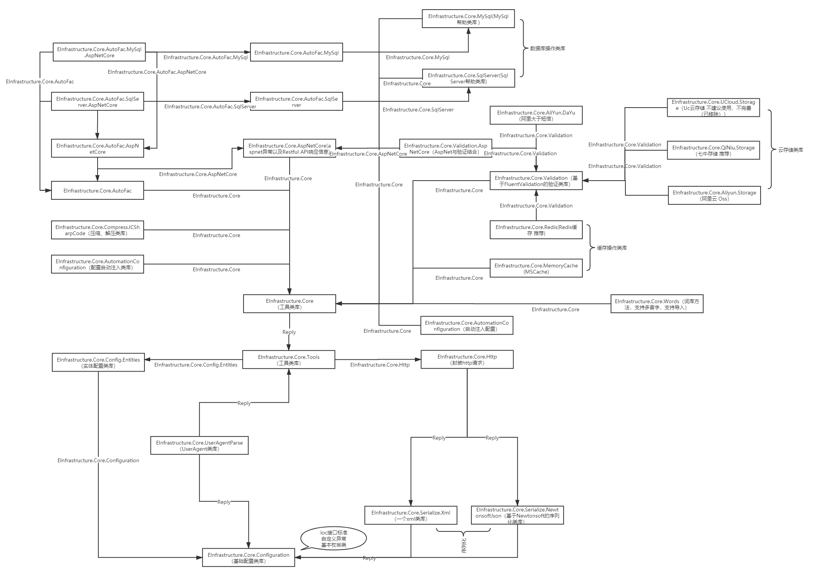

  

# System.Extension.Core 2.0

&emsp;&emsp;System.Extension.Core是一个NetCore上的基础类库，此类库中封装了我们常用的基础方法，通过此类库，可以大大提高我们的开发效率，其中还封装了文件上传类库（七牛）、短信帮助类（阿里云）、缓存帮助类（Redis、Memcache）、以及与数据库的交互类库（mysql、sqlserver）、配置文件自动注入等

&emsp;&emsp;其中对NetCore的Web项目有更好的支持，通过简单的配置即可完成对Netcore项目的搭建。

本项目已同步发布至nuget.org以及github，自2.0系列开始，两平台同步发布，因为项目还在不断地优化，建议您升级到最新的正式发布版，预发布版本虽然修复了很多bug，但为了更好的使用，方法的使用上以及命名上后期还有可能变更，如果您有任何问题可进行提问

项目依赖关系简图：

&emsp;&emsp;nuget.org源地址：https://api.nuget.org/v3/index.json 

&emsp;&emsp;github源地址：https://nuget.pkg.github.com/zhenlei520/index.json